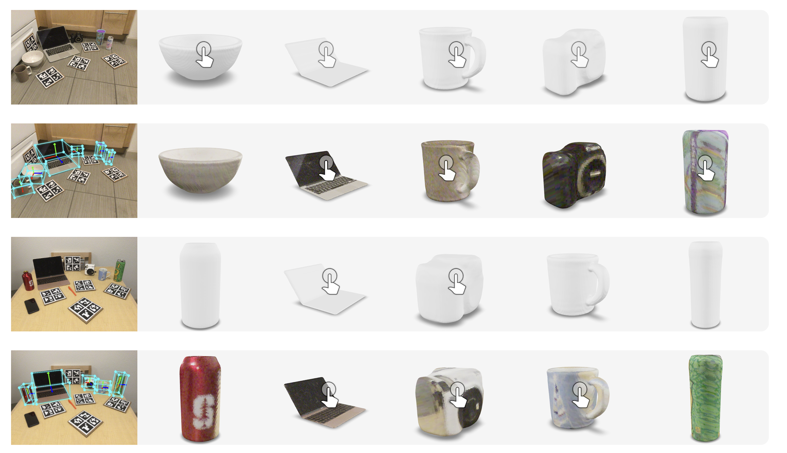
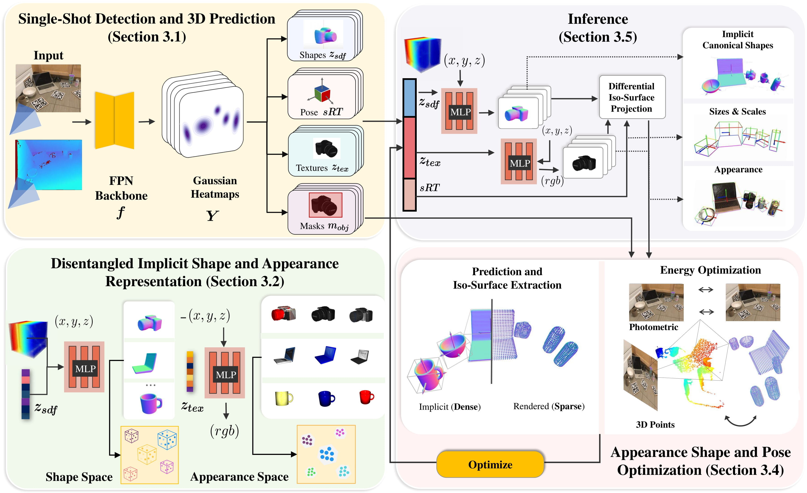
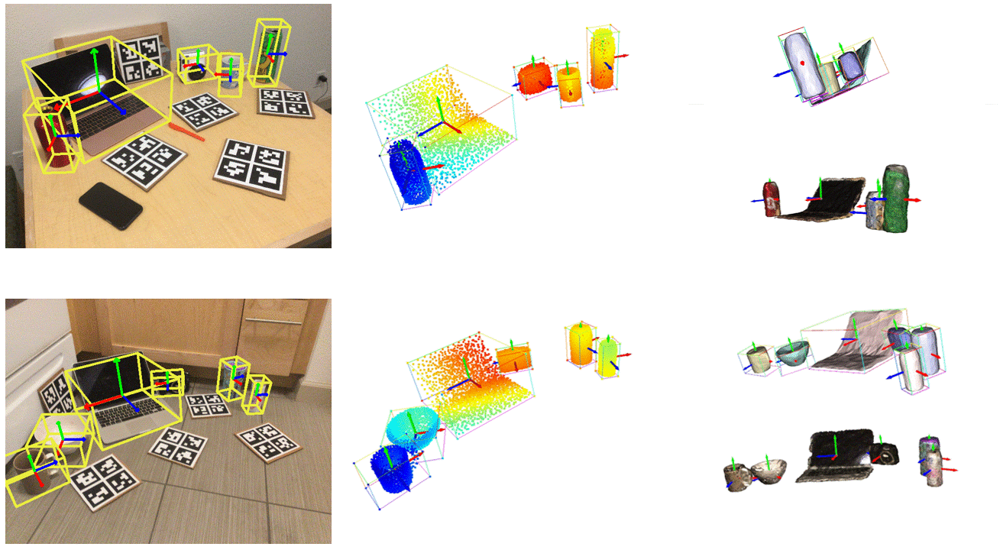

# ShAPO:tophat:: Implicit Representations for Multi-Object Shape, Appearance and Pose Optimization
[](https://opensource.org/licenses/MIT)

This repository is the pytorch implementation of our paper:
<a href="https://www.tri.global/" target="_blank">
 
</a>

**ShAPO: Implicit Representations for Multi-Object Shape, Appearance and Pose Optimization**<br>
[__***Muhammad Zubair Irshad***__](https://zubairirshad.com), [Sergey Zakharov](https://zakharos.github.io/), [Rares Ambrus](https://www.tri.global/about-us/dr-rares-ambrus), [Thomas Kollar](http://www.tkollar.com/site/), [Zsolt Kira](https://faculty.cc.gatech.edu/~zk15/), [Adrien Gaidon](https://adriengaidon.com/) <br>
European Conference on Computer Vision (ECCV), 2022<br>

[[Project Page](https://zubair-irshad.github.io/projects/ShAPO.html)] [[arXiv](https://arxiv.org/abs/2207.13691)] [[PDF](https://arxiv.org/pdf/2207.13691.pdf)] [[Video](https://youtu.be/LMg7NDcLDcA)] [[Poster](https://zubair-irshad.github.io/projects/resources/Poster%7CCenterSnap%7CICRA2022.pdf)] 

[](https://colab.research.google.com/github/zubair-irshad/shapo/blob/master/notebook/explore_ShAPO.ipynb)<br>

Previous ICRA'22 work:

**CenterSnap: Single-Shot Multi-Object 3D Shape Reconstruction and Categorical 6D Pose and Size Estimation**<br>
[__***Muhammad Zubair Irshad***__](https://zubairirshad.com), [Thomas Kollar](http://www.tkollar.com/site/), [Michael Laskey](https://www.linkedin.com/in/michael-laskey-4b087ba2/), [Kevin Stone](https://www.linkedin.com/in/kevin-stone-51171270/), [Zsolt Kira](https://faculty.cc.gatech.edu/~zk15/) <br>
International Conference on Robotics and Automation (ICRA), 2022<br>

[[Project Page](https://zubair-irshad.github.io/projects/CenterSnap.html)] [[arXiv](https://arxiv.org/abs/2203.01929)] [[PDF](https://arxiv.org/pdf/2203.01929.pdf)] [[Video](https://www.youtube.com/watch?v=Bg5vi6DSMdM)] [[Poster](https://zubair-irshad.github.io/projects/resources/Poster%7CCenterSnap%7CICRA2022.pdf)]

<p align="center">

</p>

<p align="center">

</p>

## Citation

If you find this repository useful, please consider citing:

```
@inproceedings{irshad2022shapo,
  title={ShAPO: Implicit Representations for Multi-Object Shape Appearance and Pose Optimization},
  author={Muhammad Zubair Irshad and Sergey Zakharov and Rares Ambrus and Thomas Kollar and Zsolt Kira and Adrien Gaidon},
  journal={European Conference on Computer Vision (ECCV)},
  year={2022},
  url={https://arxiv.org/abs/2207.13691},
}

@inproceedings{irshad2022centersnap,
  title={CenterSnap: Single-Shot Multi-Object 3D Shape Reconstruction and Categorical 6D Pose and Size Estimation},
  author={Muhammad Zubair Irshad and Thomas Kollar and Michael Laskey and Kevin Stone and Zsolt Kira},
  journal={IEEE International Conference on Robotics and Automation (ICRA)},
  year={2022},
  url={https://arxiv.org/abs/2203.01929},
}
```

### Contents
 - [🤝 Google Colab](#-google-colab)
 - [💻 Environment](#-environment)
 - [📊 Dataset](#-dataset)
 - [✨ Training and Inference](#-training-and-inference)
 - [📝 FAQ (**Updated**)](#-faq)

## 🤝 Google Colab

If you want to experiment with ShAPO, we have written a [Colab](https://colab.research.google.com/github/zubair-irshad/shapo/blob/master/notebook/explore_ShAPO.ipynb). It's quite comprehensive and easy to setup. It goes through the following experiments / ShAPO properties:

- Single Shot inference
  -  Visualize peak and depth output
  -  Decode shape with predicted textures
  -  Project 3D Pointclouds and 3D bounding boxes on 2D image
- Shape, Appearance and Pose Optimization
  -  Core optimization loop
  -  Viusalizing optimized 3D output (i.e. textured asset creation)


## 💻 Environment

Create a python 3.8 virtual environment and install requirements:

```bash
cd $ShAPO_Repo
conda create -y --prefix ./env python=3.8
conda activate ./env/
./env/bin/python -m pip install --upgrade pip
./env/bin/python -m pip install -r requirements.txt -f https://download.pytorch.org/whl/torch_stable.html
```
The code was built and tested on **cuda 10.2**

## 📊 Dataset

Download [camera_train](http://download.cs.stanford.edu/orion/nocs/camera_train.zip), [camera_val](http://download.cs.stanford.edu/orion/nocs/camera_val25K.zip),
[real_train](http://download.cs.stanford.edu/orion/nocs/real_train.zip), [real_test](http://download.cs.stanford.edu/orion/nocs/real_test.zip),
[ground-truth annotations](http://download.cs.stanford.edu/orion/nocs/gts.zip),
[camera_composed_depth](http://download.cs.stanford.edu/orion/nocs/camera_composed_depth.zip), [mesh models](http://download.cs.stanford.edu/orion/nocs/obj_models.zip) and [eval_results](https://drive.google.com/file/d/1p72NdY4Bie_sra9U8zoUNI4fTrQZdbnc/view?usp=sharing) provided by [NOCS](https://github.com/hughw19/NOCS_CVPR2019) and [nocs preprocess data](https://www.dropbox.com/s/8im9fzopo71h6yw/nocs_preprocess.tar.gz?dl=1).<br/>
Also download [sdf_rgb_pretrained_weights](https://www.dropbox.com/s/929kz7zuxw8jajy/sdf_rgb_pretrained.tar.xz?dl=1). 
Unzip and organize these files in $ShAPO_Repo/data as follows:
```
data
├── CAMERA
│   ├── train
│   └── val
├── Real
│   ├── train
│   └── test
├── camera_full_depths
│   ├── train
│   └── val
├── gts
│   ├── val
│   └── real_test
├── results
│   ├── camera
│   ├── mrcnn_results
│   ├── nocs_results
│   └── real
├── sdf_rgb_pretrained
│   ├── LatentCodes
│   ├── Reconstructions
│   ├── ModelParameters
│   ├── OptimizerParameters
│   └── rgb_net_weights
└── obj_models
    ├── train
    ├── val
    ├── real_train
    ├── real_test
    ├── camera_train.pkl
    ├── camera_val.pkl
    ├── real_train.pkl
    ├── real_test.pkl
    └── mug_meta.pkl

```
Create image lists
```
./runner.sh prepare_data/generate_training_data.py --data_dir /home/ubuntu/shapo/data/nocs_data/
```
Now run distributed script to collect data locally in a few hours. The data would be saved under `data/NOCS_data`. 

**Note**: The script uses multi-gpu and runs 8 workers per gpu on a 16GB GPU. Change `worker_per_gpu` variable depending on your GPU size. 
```
python prepare_data/distributed_generate_data.py --data_dir /home/ubuntu/shapoplusplus/data/nocs_data --type camera_train

--type chose from 'camera_train', 'camera_val', 'real_train', 'real_val'
```

## ✨ Training and Inference

ShAPO is a two-stage process; First, a single-shot network to predict 3D shape, pose and size codes along with segmentation masks in a per-pixel manner. Second, test-time optimization of joint shape, pose and size codes given a single-view RGB-D observation of a new instance.

<p align="center">

</p>

1. Train on NOCS Synthetic (requires 13GB GPU memory):
```bash
./runner.sh net_train.py @configs/net_config.txt
```

Note than *runner.sh* is equivalent to using *python* to run the script. Additionally it sets up the PYTHONPATH and ShAPO Enviornment Path automatically. 
Also note that this part of the code is similar to [CenterSnap](https://github.com/zubair-irshad/CenterSnap). We predict **implicit shapes** as SDF MLP instead of pointclouds and additionally also predict **appearance embedding** and **object masks** in this stage. 

2. Finetune on NOCS Real Train (Note that good results can be obtained after finetuning on the Real train set for only a few epochs i.e. 1-5):
```bash
./runner.sh net_train.py @configs/net_config_real_resume.txt --checkpoint \path\to\best\checkpoint
```

3. Inference on a NOCS Real Test Subset

Download a small Real test subset from [here](https://www.dropbox.com/s/cvqyhr67zpxyq36/test_subset.tar.xz?dl=1), our shape and texture decoder pretrained checkpoints from [here](https://www.dropbox.com/s/929kz7zuxw8jajy/sdf_rgb_pretrained.tar.xz?dl=1) and shapo pretrained checkpoints on real dataset [here](https://www.dropbox.com/s/nrsl67ir6fml9ro/ckpts.tar.xz?dl=1).
Unzip and organize these files in $ShAPO_Repo/data as follows:
```
test_data
├── Real
│   ├── test
|   ckpts
└── sdf_rgb_pretrained
    ├── LatentCodes
    ├── LatentCodes
    ├── Reconstructions
    ├── ModelParameters
    ├── OptimizerParameters
    └── rgb_net_weights
```

Now run the inference script to visualize the single-shot predictions as follows:
```
bash
./runner.sh inference/inference_real.py @configs/net_config.txt --test_data_dir path_to_nocs_test_subset --checkpoint checkpoint_path_here
```

You should see the **visualizations** saved in ```results/ShAPO_real```. Change the --ouput_path in *config.txt to save them to a different folder

4. Optimization 

This is the core optimization script to update latent shape and appearance codes along with 6D pose and sizes to better the fit the unseen single-view RGB-D observation. For a quick run of the core optimization loop along with visualization, see this [notebook](linktonotebook) here

```bash
./runner.sh opt/optimize.py @configs/net_config.txt --data_dir /path/to/test_data_dir/ --checkpoint checkpoint_path_here
```

## 📝 FAQ

Please see FAQs from CenterSnap [here](https://github.com/zubair-irshad/CenterSnap#-faq)

## Acknowledgments
* This code is built upon the implementation from [CenterSnap](https://github.com/zubair-irshad/CenterSnap)

## Related Work
* [CenterSnap: Single-Shot Multi-Object 3D Shape Reconstruction and Categorical 6D Pose and Size Estimation, ICRA, 2022](https://zubair-irshad.github.io/projects/CenterSnap.html)

<p align="center">

</p>

## Licenses
* This repository is released under the [CC BY-NC 4.0](https://github.com/zubair-irshad/shapo/blob/master/LICENSE.md) license.
